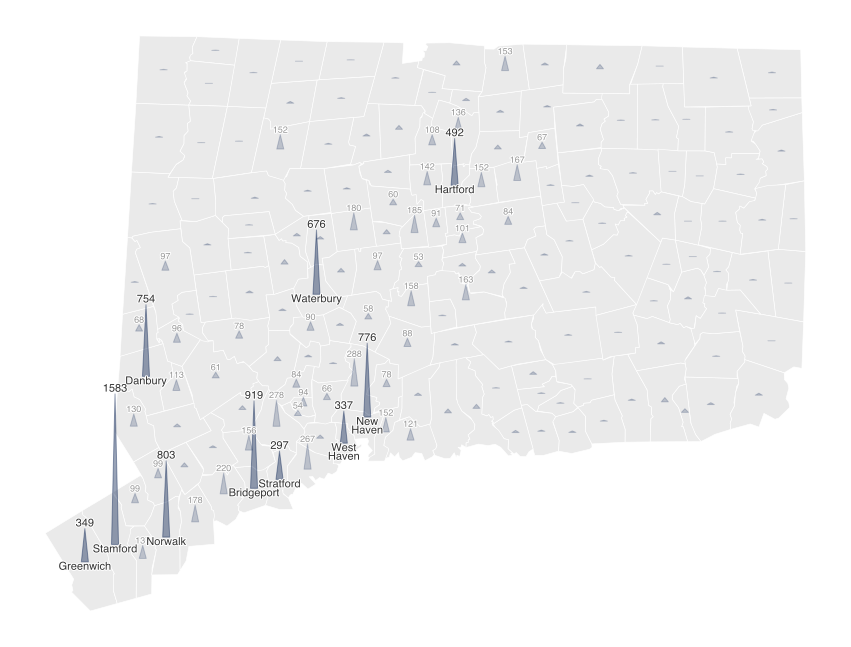
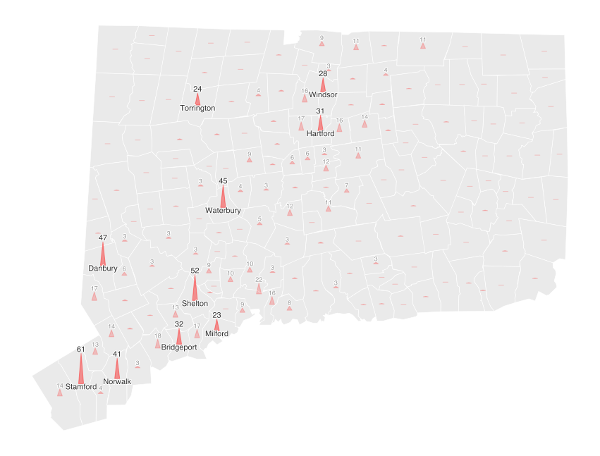

# Spike Map
Jupyter notebook to generate spike maps with `geopandas` and `matplotlib`.

## Inspiration
This project is inspired by NYTimes Covid-19 reporting
(see [*See How the Coronavirus Death Toll Grew Across the U.S.*](https://www.nytimes.com/interactive/2020/04/06/us/coronavirus-deaths-united-states.html)
article from April 6, 2020), and [@puntofisso's electoral map](https://github.com/puntofisso/SpikesMap).

Each spike is a triangle that grows from the centroid of each geography, and its
height represents a value (taller triangle = higher value).
Hence, a spike map is a very literal way to visualise spatial distribution.

## Results

### Total Covid-19 cases by town in Connecticut, April 15, 2020

### Total Covid-19 deaths by town in Connecticut, April 15, 2020
